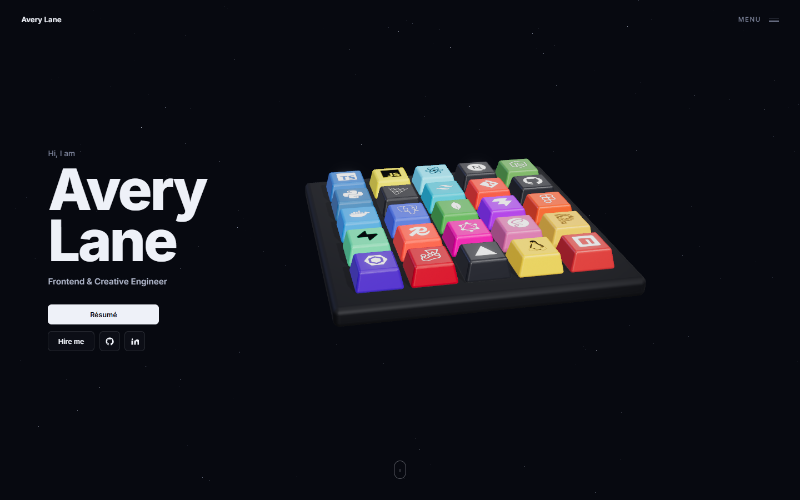
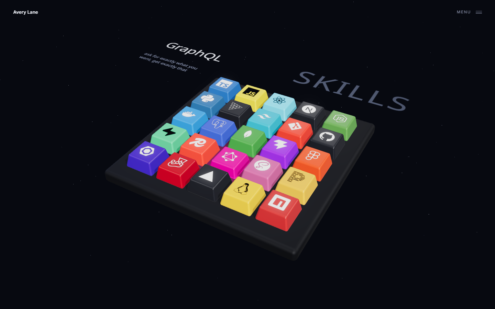
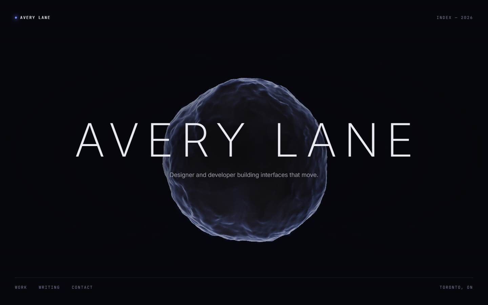

# threejs-design

A [Claude Skill](https://docs.claude.com/en/docs/agents-and-tools/agent-skills/overview) that
makes Claude good at building polished, animated Three.js sites — the kind that look like a studio
made them, rather than like a tutorial.

Most bad WebGL on the web is not bad because of the geometry. It is bad because there is no
environment map, the camera is on a 75° wide-angle lens, textures are mistagged so materials read
as plastic, tone mapping is off, and every animation is a raw `lerp` that runs at a different speed
on a 120 Hz display. This skill encodes those decisions and roughly forty more, with the reasoning
attached so Claude can depart from them when the concept calls for it.



*Built by following the skill, in [`demo-keyboard/`](demo-keyboard/). Two demos, details below.*

## Install

Skills live in a `skills/` directory that Claude Code discovers automatically. Copy the
`threejs-design/` folder into one of them:

```bash
# Available in every project (personal skill)
git clone https://github.com/ShivaPriyanShanmuga/threejs-design-skill.git
cp -r threejs-design-skill/threejs-design ~/.claude/skills/

# Or scoped to a single project, checked in alongside the code
cp -r threejs-design-skill/threejs-design .claude/skills/
```

Then start a session and ask for something 3D. The skill is model-invoked: Claude reads the
frontmatter description and decides to load it on its own — you never name it.

It triggers on the obvious things — Three.js, R3F, drei, WebGL, GLSL, shaders, 3D heroes,
scrollytelling, product viewers, particles — and also on requests that never mention 3D at all
("make the landing page feel more premium", "something animated behind the headline", "like an
Awwwards site"), plus on debugging ("this looks flat", "washed out", "why is it so dark",
"janky on mobile").

## How it is organised

`SKILL.md` is under 100 lines and is the only file always in context. It routes by stack (R3F vs
vanilla) and by archetype (hero/ambient, scroll narrative, shader art, product viewer), so a
shader task never loads R3F patterns and a product viewer never loads scroll machinery. It also
carries the handful of defaults that decide the look, and a diagnosis table that maps symptoms to
the one file worth opening.

| File | What it covers |
| --- | --- |
| [`references/r3f.md`](threejs-design/references/r3f.md) | React Three Fiber and drei. Canvas config, `useFrame` and damping, the memoisation mistakes that quietly cost frames, the drei components worth knowing, canvas-behind-DOM-text layout, Suspense loading, and what R3F will and will not dispose for you. |
| [`references/vanilla.md`](threejs-design/references/vanilla.md) | Plain Three.js with Vite. Correct boilerplate, resize handling (including the DPR case people miss), the `Timer` loop, Draco/KTX2 loading, and explicit teardown. |
| [`references/materials-lighting.md`](threejs-design/references/materials-lighting.md) | The pipeline that decides whether a scene reads as photographed: colour management and texture tagging, tone mapping, environment maps, the r155 lighting-unit change, shadow frusta, and tested parameter sets for brushed metal, clearcoat, transmission glass, iridescence, and sheen. |
| [`references/shaders.md`](threejs-design/references/shaders.md) | GLSL. fbm and domain warping, fresnel, recomputing normals after displacement, `Points` with perspective-correct `gl_PointSize`, curl-noise flow fields, when to move to GPGPU, and the colour mistakes that make procedural work look cheap. |
| [`references/scroll-motion.md`](threejs-design/references/scroll-motion.md) | Lenis and GSAP ScrollTrigger without desync, normalising and damping scroll progress, `CatmullRomCurve3` camera paths with look-ahead, `ScrollControls` vs Lenis, and reduced-motion handling. |
| [`references/performance.md`](threejs-design/references/performance.md) | In priority order: measure, cap DPR, cut draw calls, stop rendering when nothing changes, compress assets, degrade adaptively. Plus disposal and a symptom-to-cause table. |
| [`scripts/scaffold.sh`](threejs-design/scripts/scaffold.sh) | `scaffold.sh <name> <r3f\|vanilla>` — non-interactive Vite setup with a starter scene that already has the defaults baked in. |

## Pairs well with

**A browser automation tool — Playwright above all.** This is the one that matters. A 3D scene has
no meaningful unit test: a scene can compile clean, throw no warnings, and still be flat, washed
out, or unreadable. The only check that counts is rendering it and looking. Both demos here were
built, screenshotted with Playwright, and fixed — and every real defect in them was invisible in
the source and obvious in the image. Point Claude at a dev server, have it screenshot and *look*,
and iterate. Chrome DevTools MCP or any equivalent works the same way.

It is also worth having Claude measure rather than assert, in the same pass. Console warnings
caught two deprecations in Three.js r185 that the skill was recommending; `renderer.info` settled a
draw-call claim that would otherwise have been a guess.

**`frontend-design` (built-in).** This skill owns everything inside the `<canvas>` — scene, camera,
lighting, materials, shaders, motion. Palette, typography, layout, and spacing stay with
`frontend-design`. `SKILL.md` says so explicitly so the two compose instead of fighting over the
same decisions. Load both whenever the 3D sits inside a real page, which is most of the time.

**`run` (built-in), or whatever launches your app.** Useful for getting the dev server up before
the screenshot loop starts.

## The demos

Both were built by following the skill and then checked by screenshotting them with Playwright and
looking at the result. Personas and copy are fictional.

### [`demo-keyboard/`](demo-keyboard/) — the harder one

A two-beat portfolio rebuilt from a video reference. One 3D mechanical keyboard persists across
both beats: scroll drives it from the hero into a SKILLS view, hovering lifts a cap, and clicking
presses it down and reveals that skill's name plus a one-liner as 3D text lying in the board's own
plane. In the skills beat the whole thing is one rigid plane you can grab and turn on both axes
with the left mouse button — board, heading and caption together — and it eases back to its pose
when you scroll away.



It leans on most of the skill at once — a custom tapered keycap geometry, `InstancedMesh` with a
runtime-built logo atlas and per-instance UV offsets, raycast interaction on instances, damped
press animation, RoomEnvironment lighting, scroll-driven camera interpolation via Lenis, in-scene
troika text, and a restrained post chain, plus a damped drag-rotate with momentum that has to
distinguish a rotate from a click. The whole frame costs **25 draw calls**, measured — about 73
without instancing.

### [`demo/`](demo/) — the simpler one

A single hero: a slow displaced sphere behind the name that reacts to the mouse and stays out of
the type's way.



Its shader is fbm with one level of domain warping, normals recomputed from the displaced surface,
a fresnel rim, an Inigo Quilez cosine palette, and a dither. Post is bloom at `luminanceThreshold`
0.9 so only the rim glows, a vignette, and 3% grain.

```bash
cd demo-keyboard && npm install && npm run dev   # or: cd demo
```

### What testing them changed

Building the demos was the point — several defects only showed up once there was something to look
at, and two of them were corrections to the skill itself:

- **`THREE.Clock` is deprecated as of r185.** The vanilla reference and the scaffold now use
  `THREE.Timer` with `connect(document)`.
- **`PCFSoftShadowMap` is deprecated as of r185** — three warns and silently falls back to
  `PCFShadowMap`. `materials-lighting.md` no longer recommends it.

And in the demos themselves: a palette authored in linear space that rendered far too bright, a
cosine palette whose per-channel frequencies cycled the hue into orange, 25 logo decals left
standing upright because a `PlaneGeometry` faces +Z, brand colours washed to pastel by
over-lighting, and a 6.6 MB bundle from a namespace import that defeated tree-shaking. Each demo's
README has the details.

## License

MIT — see [LICENSE](LICENSE).
