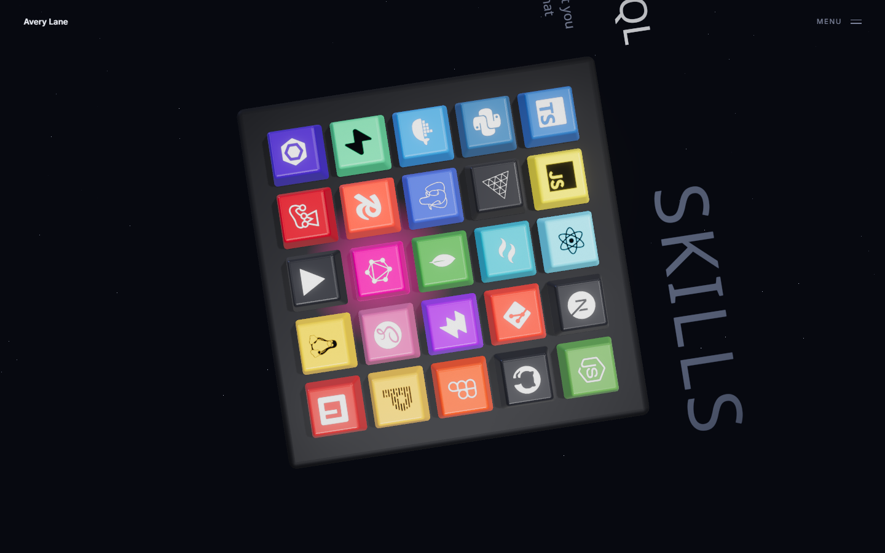

# demo-keyboard

A harder test of the `threejs-design` skill: a two-beat portfolio built from a video reference,
where one 3D mechanical keyboard persists across both. Scrolling drives it from the hero's
three-quarter view into a SKILLS view. A cap sits at three depths — lifted on hover, bottomed out
while the button is held, and latched part way down once chosen — and choosing one reveals that
skill's name and a one-liner as 3D text lying in the board's own plane.

In the skills beat the whole thing is one rigid plane you can grab: hold left mouse and drag to
turn it on both axes, board, caption, heading and all.

The persona and copy are fictional.

```bash
npm install
npm run dev
```




| File | |
| --- | --- |
| `src/App.jsx` | DOM layer, Lenis, and the scroll progress that everything reads |
| `src/Scene.jsx` | Camera rig, environment, lights, starfield, post chain |
| `src/Keyboard.jsx` | Instanced caps and decals, interaction, press animation, in-scene text |
| `src/keycap.js` | The keycap geometry |
| `src/atlas.js` | Runtime logo atlas and the glow sprite |
| `src/tech.js` | 25 technologies, their brand colours, and their one-liners |

## The parts worth reading

**The keycap is a tapered rounded box.** `RoundedBoxGeometry` cannot taper, so the vertices are
scaled in x/z by their own height in a single pass. That is the whole difference between a rounded
die and something that reads as a key. Normals have to be recomputed after, since moving vertices
invalidates them — the same trap as displacing a plane in a vertex shader.

**Two draw calls carry the whole board.** The 25 caps are one `InstancedMesh` with per-instance
colour. The 25 logos are a second one, sampling a single 1280×1280 atlas built at runtime from
`simple-icons` paths on a canvas; each instance carries a `vec2` UV offset for its own cell, fed in
through a four-line `onBeforeCompile` patch. One texture per logo would have meant 25 materials and
25 more calls.

Measured, not assumed: **25 draw calls for the entire frame**, including the shadow pass and every
post-processing pass. Without instancing the caps and decals it would be about 73. In dev,
`__gl.info.render.calls` is on `window` — though `info.render` resets per pass, so with a composer
you have to set `autoReset = false` and accumulate a frame to get a true number.

**The 3D text is in the board's group**, not overlaid on the page. That is why it inherits the
board's rotation and is occluded by the caps, which is what makes it read as part of the object.

**The skills pose is chosen for legibility.** The type lies in the plane, so the plane's angle is
the type's angle. Yaw is only 0.15 rad — enough that it does not read as a flat screenshot, little
enough that the heading still reads as a line rather than a diagonal — and the board carries a
0.22 rad base pitch that tips it toward the camera. The camera sits about 43° above the plane and
that base adds another 13°, which is most of the difference between a caption you read and one you
decipher.

**Drag-to-rotate is two nested groups**, pitch on the outer and yaw on the inner. One group with
an euler triple would gimbal and start rolling the board. Pointer deltas move a target, the
rendered value damps toward it at lambda 11 so the board lags a few frames behind the cursor, and
the release velocity is kept in radians per second so a throw decays the same at any frame rate.
Yaw is free; pitch is clamped — and since the drag offset now sits on top of a base pitch, it is
clamped against what that base leaves rather than against zero.

Five things that only matter once it moves:

- **A rotate must not select a key.** Both end in a pointerup over some cap. The press records how
  far it travelled, and anything over 14px sets a flag the click handler checks and bails on. The
  flag is cleared on the next pointerdown, not on a timer, so it cannot race the click event.
  That threshold started at 6px, which was too tight: an ordinary mouse wanders more than that
  during a normal click, so real clicks were being swallowed and no cap ever latched.
- **Hover is suppressed mid-drag.** The pointer sweeps across every cap on the way round, and
  letting hover follow it strobes the glow across the board.
- **Text has to stay readable.** Rigidly attached, a half turn leaves the caption upside-down. It
  counter-rotates about the plane's own normal by the *nearest half turn* — so under 90° the
  designed skew is untouched, and past it the type swings around inside the plane rather than
  inverting. It is still in the plane, still occluded by the caps.
- **Yaw must not accumulate.** Spinning the board a few turns one way left the drag yaw at a dozen
  radians, and scrolling back up then unwound every one of them on screen. Whenever it leaves
  (−π, π], the target and its damped value are shifted by the same whole turn — visually a no-op,
  since the rotation differs by a multiple of 2π — which caps the worst case at half a turn.
- **The pose resets out of sight.** Below 15% progress the yaw and pitch offsets ease to zero.
  That happens where nothing is visible, so scrolling down always arrives at the designed pose
  rather than wherever it was left. The selection is cleared on the same journey — otherwise the
  hero keeps glowing under a pressed key you can no longer see.

Drag is bound to mouse and pen only. On touch, a vertical swipe is how you scroll the page, and
capturing it to rotate the board would trap the reader in the section.

**Scroll is normalised once.** Lenis emits `progress`, `App` writes it to a ref, and the scene
damps toward it at lambda 4 — the board lagging slightly behind the page is what gives it weight.
The camera interpolates between two poses rather than following a spline; with two keyframes a
damped lerp is the right tool and a `CatmullRomCurve3` would be ceremony.

## What the screenshot pass caught

- **The logos were standing upright.** A `PlaneGeometry` faces +Z, and instancing it with a pure
  translation left 25 little billboards hovering above the caps. The rotation has to be baked into
  the geometry (`g.rotateX(-Math.PI / 2)`), not applied per instance.
- **The caps came out pastel.** Brand colours were washing to candy under a 0.8 environment plus
  two directional lights at 2.4 and 1.5. Cutting the environment to 0.42, `envMapIntensity` to
  0.45, and the lights to 1.35/0.75 brought the actual brand colours back. Over-lighting reads as
  desaturation long before it reads as brightness.
- **The bundle was 6.6 MB.** `import * as si from 'simple-icons'` defeats tree-shaking and pulls in
  all ~3200 icons. Named imports took it to 1.35 MB (389 KB gzipped).
- **The first framing was far too close**, and the in-scene caption collided with the skill name.

It also turned up a correction to the skill itself: `PCFSoftShadowMap` is deprecated as of r185 —
three warns and silently falls back to `PCFShadowMap` — so `references/materials-lighting.md` no
longer recommends it.

## Attribution

Logo paths and brand colours come from [simple-icons](https://github.com/simple-icons/simple-icons)
(CC0-1.0). The trademarks belong to their respective owners; they are used here to identify the
technologies, which is what a skills grid is for.

The design is an original rebuild, following the composition and interaction idea of a
[YouTube Short](https://www.youtube.com/shorts/CI5uyCDkwKY) by TechWorsh showing Rukesh Babu's
portfolio. No code or assets were taken from it.
