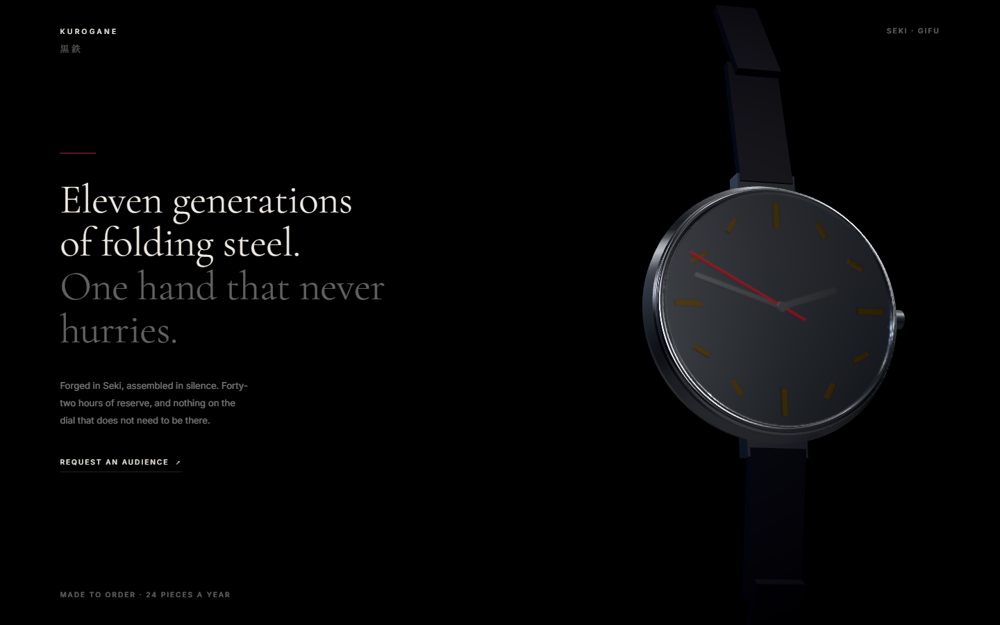
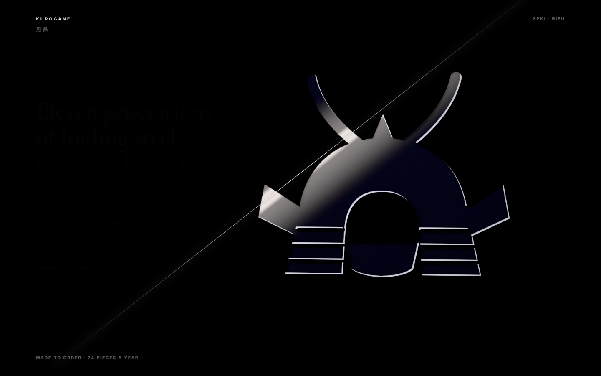
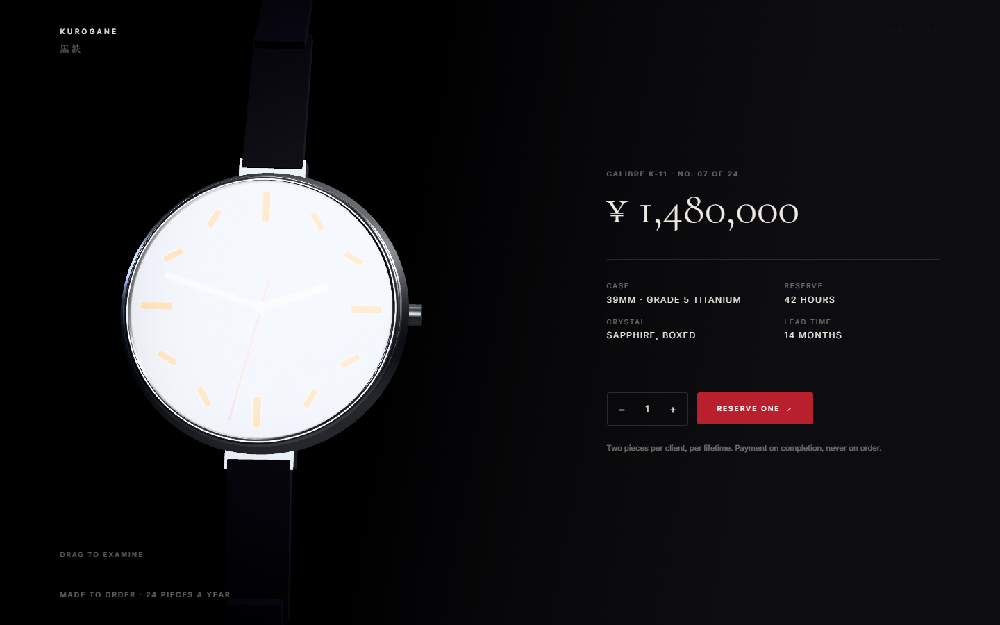
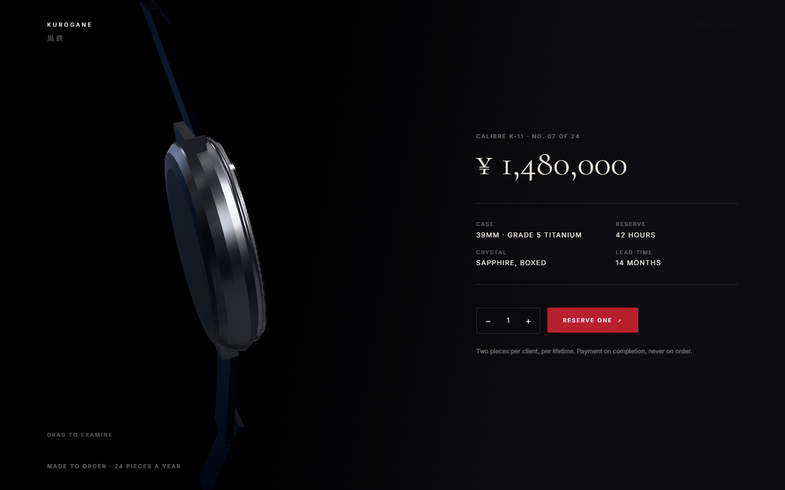

# demo-samurai — KUROGANE

A test of whether the skill helps with **design**, not just correctness. A detailed brief was
written first ([`../evals/design-brief-samurai.md`](../evals/design-brief-samurai.md)), then built
against without loosening it.

```bash
npm install
npm run dev
```









Three beats. A kabuto sits behind the type, non-interactive, flat but shaded to feel
dimensional. On scroll the screen is cut on a diagonal; the wound widens into the reserve
panel on the right, and the watch settles on the left where **you can pick it up and turn
it** — free yaw, so a full turn shows the caseback, and clamped pitch, because past vertical
it stops reading as an object in the hand and starts reading as a broken transform.

The idle rotation stops the moment it becomes yours to handle: something that keeps drifting
while you are trying to look at it feels broken rather than alive.

## The figure that had to stop being a figure

The first version of this put a **modelled** samurai on the page — a bust of kabuto, mempo, dō and
sode built from lathes and stacked cylinders. It looked like a mascot, and the honest read is that
it was never going to look like anything else.

Procedural geometry is good at objects and bad at figures. The failure is in proportion and
anatomy, not shading, so no amount of material tuning reaches it. Five more drafts of a hand-coded
2D silhouette of a full samurai went the same way: the arms merged with the head, and the gaps
that survived landed beside the face, where small holes read as **eyes** and turn anything comic.

The fix was to stop drawing a samurai and draw a **kabuto**. One object, no anatomy, no accidental
faces, and it says "samurai" in a single glance. Reduce to the form you can execute perfectly,
then execute it perfectly — that is now a section in
[`art-direction.md`](../threejs-design/references/art-direction.md), along with the silhouette
rules the bad drafts taught.

## How a flat mark reads as an object

The kabuto is a canvas drawing on a quad — genuinely 2D, no geometry. Everything dimensional is
faked from the alpha: offsetting the mask against itself and taking the difference gives a lit
edge on one side and a dark one opposite, and the eye reads a rim highlight as form. Wider taps
add falloff inward so the middle is not flat, and the parallax moves the quad rather than any
model. `raycast` returns null, so it is not interactive and cannot quietly eat clicks.

## Handing the object over

Pitch lives on the outer group and yaw on the inner one. A single euler triple carrying both
gimbals and starts rolling the watch, which is exactly what stops it feeling like a real thing
being turned. Drag deltas move a target, the rendered value damps toward it, and release
velocity is kept in radians per second so a throw decays the same at any frame rate.

Two details that decide whether it feels right rather than merely works:

- **The overlay must not take pointer events.** The reserve panel covers the full viewport so
  its clip-path can open across the whole diagonal — so `.reveal` is `pointer-events: none` and
  only `.reveal__panel` re-enables them. Otherwise an invisible sheet sits over the watch and
  swallows every drag aimed at it.
- **Accumulated yaw is wrapped** to (−π, π]. Without it, spinning the watch a few turns and then
  scrolling away unwinds every one of them on screen.

## The cut

A hairline in the DOM, because a one-pixel line stays one pixel at any DPR while a shader
antialiases it into mush. The glow across the helmet is in the shader, and the two have to be the
*same* stroke — so the shader computes its band in **screen space** from `gl_FragCoord`, not from
UVs. The first attempt used a UV diagonal, which is at the mercy of the quad's position and
aspect: the two landed on different lines and the page read as two unrelated events.

The reserve panel is not faded in. It is always there, and a `clip-path` band centred on the same
diagonal widens across it, so the content is revealed by the wound rather than by opacity.

## What the skill did and did not supply

**It supplied,** and would have supplied to anyone: environment before lights, so the steel reads
as steel; `fov: 35`; the material parameter sets more or less verbatim — brushed steel at
roughness 0.3, a polished bezel at 0.075, sapphire as `transmission` with `ior: 1.77` and a
thickness matched to the real part, sheen on the leather, clearcoat on the lacquer hand;
`NeutralToneMapping` because this is a product shot and Khronos PBR Neutral is the one that keeps
a lacquer red the same red; a tight shadow frustum; a capped DPR; damped everything. And no
bloom, which on a page this dark is the difference between expensive and cheap.

**It did not supply** the art direction: one accent used exactly twice, the asymmetric layout with
a hard left margin, the decision to let half the frame do nothing, the type pairing, or the
decision to rake the key light instead of pointing it at the subject. Those came from outside the
skill — which is precisely the gap this build was run to find.

The skill has since gained [`art-direction.md`](../threejs-design/references/art-direction.md),
which is where those decisions now live.

## Three things the build got wrong first

Worth reading because none of them are visible in source, and all three looked like material
problems when they were not.

**The dial was facing away.** The watch is built in "watch space" with +Y out of the dial, then
tipped to face the camera — and `rotation={[-Math.PI / 2, 0, 0]}` maps local +Y to world **−Z**,
which points it at the back wall. The first render was a chrome dome: the caseback, seen head on.
Check which way an object faces before you start adjusting its materials.

**`rotation` on a geometry element does nothing.** `<torusGeometry rotation={...} />` is silently
ignored — transforms are `Object3D` properties and a geometry is not one. The bezel stayed in the
XY plane and cut across the case like an equator. Now in `r3f.md`.

**A matte black dial under a frontal key renders grey.** The dial colour was already near black
and it kept coming out as a light disc. Darkening the material again did nothing, because the
material was not the cause: a strong key pointed at a matte surface produces exactly that. Moving
the key behind the plane of the dial so it rakes across the case, and adding a weak frontal fill
to put light back into the hands and markers, fixed it in one change. That is a photographer's
move rather than a renderer's, and it is now the first section of `art-direction.md`.

A fourth, smaller: the sapphire was veiling the dial with reflected environment. `envMapIntensity:
0.4` on the crystal alone keeps the case bright and lets the dial go black.

## Notes

Fictional brand, fictional copy. `Cormorant Garamond` for the display, `Inter` for everything
else, `Noto Serif JP` for 黒鉄.
