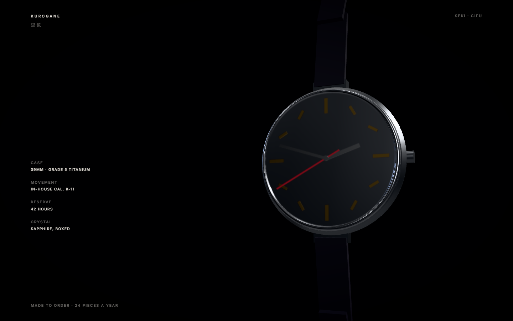

# demo-samurai — KUROGANE

A test of whether the skill helps with **design**, not just correctness. A detailed brief was
written first ([`../evals/design-brief-samurai.md`](../evals/design-brief-samurai.md)), then built
against without loosening it.

```bash
npm install
npm run dev
```




## What the skill did and did not supply

**It supplied,** and would have supplied to anyone: environment before lights, so the steel reads
as steel; `fov: 35`; the material parameter sets more or less verbatim — brushed steel at
roughness 0.3, a polished bezel at 0.075, sapphire as `transmission` with `ior: 1.77` and a
thickness matched to the real part, sheen on the leather, clearcoat on the lacquer hand;
`NeutralToneMapping` because this is a product shot and Khronos PBR Neutral is the one that keeps
a lacquer red the same red; a tight shadow frustum; a capped DPR; damped everything. And no
bloom, which on a page this dark is the difference between expensive and cheap.

**It did not supply** the art direction: one accent used exactly twice, the asymmetric layout with
a hard left margin, the decision to let half the frame do nothing, the type pairing, or the
decision to rake the key light instead of pointing it at the subject. Those came from outside the
skill — which is precisely the gap this build was run to find.

The skill has since gained [`art-direction.md`](../threejs-design/references/art-direction.md),
which is where those decisions now live.

## Three things the build got wrong first

Worth reading because none of them are visible in source, and all three looked like material
problems when they were not.

**The dial was facing away.** The watch is built in "watch space" with +Y out of the dial, then
tipped to face the camera — and `rotation={[-Math.PI / 2, 0, 0]}` maps local +Y to world **−Z**,
which points it at the back wall. The first render was a chrome dome: the caseback, seen head on.
Check which way an object faces before you start adjusting its materials.

**`rotation` on a geometry element does nothing.** `<torusGeometry rotation={...} />` is silently
ignored — transforms are `Object3D` properties and a geometry is not one. The bezel stayed in the
XY plane and cut across the case like an equator. Now in `r3f.md`.

**A matte black dial under a frontal key renders grey.** The dial colour was already near black
and it kept coming out as a light disc. Darkening the material again did nothing, because the
material was not the cause: a strong key pointed at a matte surface produces exactly that. Moving
the key behind the plane of the dial so it rakes across the case, and adding a weak frontal fill
to put light back into the hands and markers, fixed it in one change. That is a photographer's
move rather than a renderer's, and it is now the first section of `art-direction.md`.

A fourth, smaller: the sapphire was veiling the dial with reflected environment. `envMapIntensity:
0.4` on the crystal alone keeps the case bright and lets the dial go black.

## Notes

Fictional brand, fictional copy. `Cormorant Garamond` for the display, `Inter` for everything
else, `Noto Serif JP` for 黒鉄.
