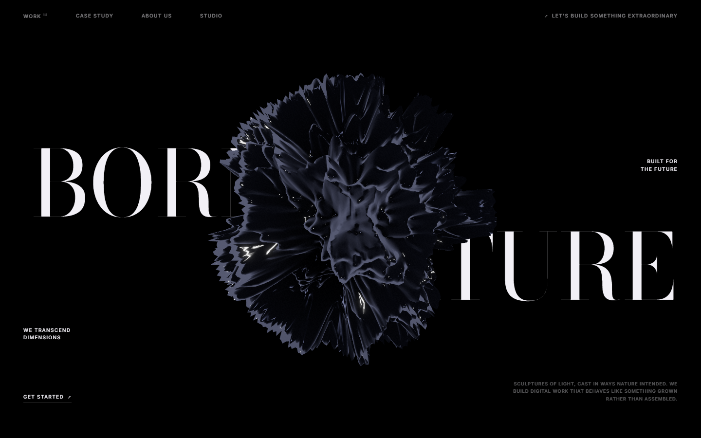
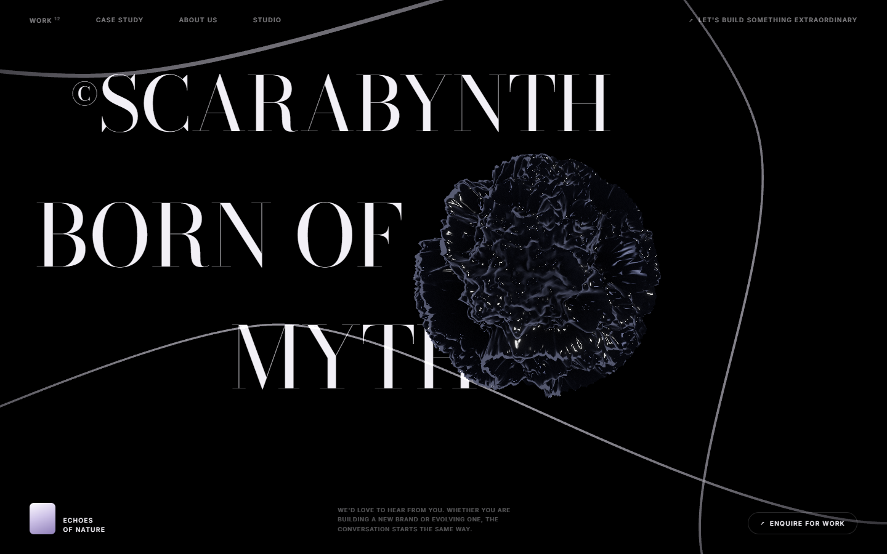

# demo-scarab

A recreation of a studio site from a video reference: three scroll beats sharing one canvas —
a black-chrome form under a split display serif, a purple volumetric bloom carrying the
manifesto, and a dark crystal with white arcs over the footer.

```bash
npm install
npm run dev
```






| File | |
| --- | --- |
| `src/App.jsx` | DOM layer, Lenis, beat opacity written straight to elements |
| `src/Scene.jsx` | Camera rig per beat, post chain |
| `src/Shard.jsx` | The dark form of beats one and three |
| `src/Burst.jsx` | The purple bloom |
| `src/Arcs.jsx` | The white curves |
| `src/shaders.js` | Noise, and the shard's displacement and black-chrome shading |

## What it gets right, and what it approximates

The composition, typography, layering and choreography are close. The type is a Didone
(Bodoni Moda) split into two absolutely-positioned halves, and the canvas sits **above** the
headline rather than below it — the reference lets the object pass in front of the words and
hide "OF N", and that overlap is most of why the frame reads as one image instead of text
over a video. The nav, side labels, manifesto and footer sit above the canvas again, on a
third layer.

The shard is an icosahedron displaced by **ridged** noise — `1 - |fbm|`, raised to a power.
Plain fbm gives soft lumps; folding it at zero produces creases, and the exponent sharpens
those into blades. It is shaded almost entirely by a fresnel rim and two hard specular lobes,
with a near-black base, which is how it survives on a pure black page. Beat three is the same
object with the amplitude down and the frequency up, not a second model.

The purple bloom is the honest approximation. The reference is almost certainly a
pre-rendered volumetric — Houdini, not a browser — and no real-time technique will match it
exactly. This one is a fragment shader on a single quad: angular noise sampled around a
circle for the spiked edge, domain-warped fbm for the internal smoke, a radial falloff, and a
dither because a smooth ramp on a black page bands badly at 8 bits.

## The bug that ate this build

The first attempt at the bloom was 160,000 additive points, and it rendered **nothing**. The
draw call was happening — `info.render.points` said 160,000 — the material compiled without
diagnostics, the mesh was visible and in the scene, and the uniforms object held the right
values when read from JavaScript.

Bisecting found it. Rendering the shader's intermediate terms as colour channels came out
pure green: the smoke term (which uses no uniforms) was fine, while every term derived from
`uProgress` was zero. The uniforms were never reaching the shader.

```js
mesh.current.material.uniforms === uniforms  // false
```

**R3F does not preserve the identity of the object you pass to a `<shaderMaterial uniforms={…}>`
prop.** Mutating your own `useMemo`'d object writes to an orphan. Nothing errors, nothing warns,
and the shader sits frozen at its initial values forever. Driving
`mesh.current.material.uniforms` instead fixed it immediately.

The same bug was in [`demo/`](../demo/) — the very first demo in this repo — where `uTime`
had never advanced and the fbm displacement had been frozen the entire time. It looked
animated only because the mesh was rotating underneath it. That is the tell to remember: a
frozen shader on a moving object looks alive.

`references/r3f.md` now carries this, with both fixes and the one-line check for it.

## Also worth copying

- **A point cloud was the wrong tool twice over.** Dense enough to read as powder means
  enormous; spread wide enough to fill the frame means too sparse to read at all. The skill
  already says it — for something that fills the frame and has no silhouette, render one quad
  and do the work in the fragment shader — and that turned out to be right.
- **Curl noise belongs in an attribute, not the vertex shader**, when it only depends on a
  seed. The first version evaluated 18 `fbm` calls — about 90 noise samples — per vertex per
  frame, at 160k vertices.
- **Normalise curl before using it as a displacement.** Curl of a noise field has unbounded
  magnitude; the finite difference divides by `2·epsilon`, so components reached ±6 and flung
  most of the cloud behind the camera, where `1/-mv.z` goes negative and the point silently
  vanishes.
- **`smoothstep(0.5, 0.02, d)` is undefined in GLSL.** Edges must be `edge0 < edge1`. Many
  drivers do the reasonable thing; it is still undefined.

## Attribution

An original rebuild, following the composition and interaction of a
[YouTube Short](https://www.youtube.com/shorts/sYGsqFtojDc) by *Code with Me*. No code or
assets were taken from it. "Scarabynth" and all copy are fictional.
