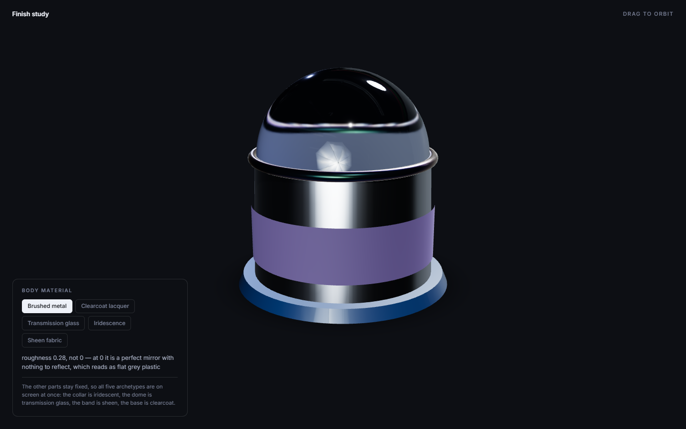
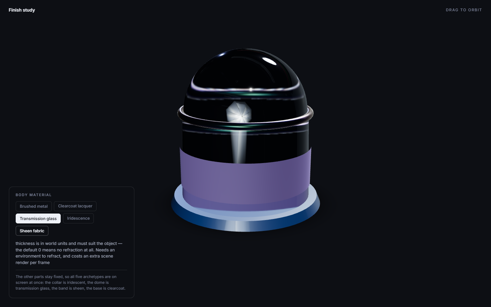

# demo-viewer

The third demo, built to cover what the other two never touched: **the glTF asset pipeline** and
**the material archetypes**. A product viewer with five parts, one per archetype, and a picker that
swaps the body between all five so you can compare them under the same light.

```bash
npm install
node scripts/make-model.mjs      # regenerates public/product.glb
npm run dev
```





| File | |
| --- | --- |
| `src/materials.js` | The five archetypes, with the reasoning attached |
| `src/Product.jsx` | glTF load, per-part material assignment, disposal |
| `src/App.jsx` | Canvas, environment, lights, contact shadows, orbit, adaptive quality |
| `scripts/make-model.mjs` | Generates the .glb |

## Why the model is generated

Every sample model worth using carries a licence to track, and none of the obvious ones are CC0.
So `scripts/make-model.mjs` builds the geometry with three (in Node — no WebGL context, just the
maths), writes it out as a .glb through `@gltf-transform/core`, and the repo owns its asset
outright.

It also means the demo exercises the path most real Three.js work uses and neither other demo
covered: a binary asset on disk, fetched over HTTP, decoded by `GLTFLoader`. The five mesh names
(`body`, `grille`, `collar`, `dome`, `base`) are the contract between the asset and the app — the
app assigns materials by name, which is what you actually do with a model from a designer.

## The Draco result is a warning, not a win

`gltf-transform optimize` took the model from 180 KB to 20.6 KB — 8.7x. That looks like an
unambiguous win until you count the decoder: Draco needs ~250 KB of WASM and wrapper fetched
before it can decompress anything.

**So compressing this model cost 90 KB net.** Draco is a fixed overhead that pays off on large
geometry or on many models sharing one decoder, and loses on a single small one. The demo keeps it
anyway, because the point is to exercise the loader path — but `performance.md` now says the
quiet part out loud, because "run gltf-transform optimize" was advice with no break-even attached.

Two other things worth copying: the full `optimize` pipeline runs `join` and `simplify`, which
would have merged the five parts into one mesh and destroyed the naming contract — `--join false
--simplify false` keeps the structure. And drei's `useGLTF` takes a decoder path as its second
argument (`useGLTF(url, '/draco/gltf/')`); passing `true` instead points it at a Google CDN, which
is both a runtime dependency on someone else's uptime and a second copy of the decoder in your
bundle.

## The five archetypes

All five are on screen at once, so they can be compared rather than described. Numbers and
reasoning are in `src/materials.js`; the short version:

- **Brushed metal** — roughness 0.28, not 0. At 0 it is a perfect mirror with nothing to reflect,
  which is why "my metal looks like grey plastic" is usually a roughness problem, not a colour one.
- **Clearcoat lacquer** — a soft, slightly rough base under a hard near-mirror coat. Matching the
  two roughness values throws the whole effect away.
- **Transmission glass** — `thickness` is in world units and must suit the object; the default 0
  means no refraction at all. Needs an environment to refract, and costs an extra scene render.
- **Iridescence** — the thickness range is in nanometres and decides which colours appear.
- **Sheen fabric** — the retroreflective grazing-angle glow that makes velvet look like velvet.

## Performance choices

`frameloop="demand"` means the viewer renders only when asked. Audited while idle it drew **2
frames** in the whole sample window, against a median of 50 draw calls per rendered frame — a
viewer that sits still 95% of the time should not be running the GPU at 60fps. `OrbitControls`
and drei call `invalidate()` for you; a material swap is not driven by `useFrame`, so `Product`
calls it explicitly, and forgetting that is exactly the bug where the swap never appears.

`ContactShadows` instead of a second shadow-casting light, a tightened shadow frustum on the one
light that does cast, and `PerformanceMonitor` + `AdaptiveDpr` dropping shadow-map and
contact-shadow resolution when frames get expensive.
